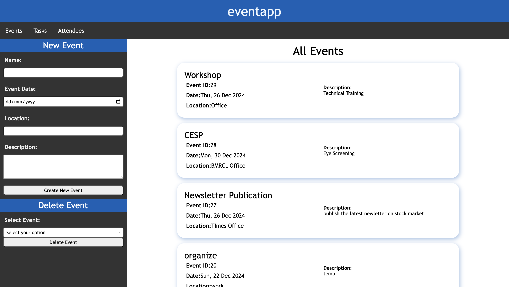
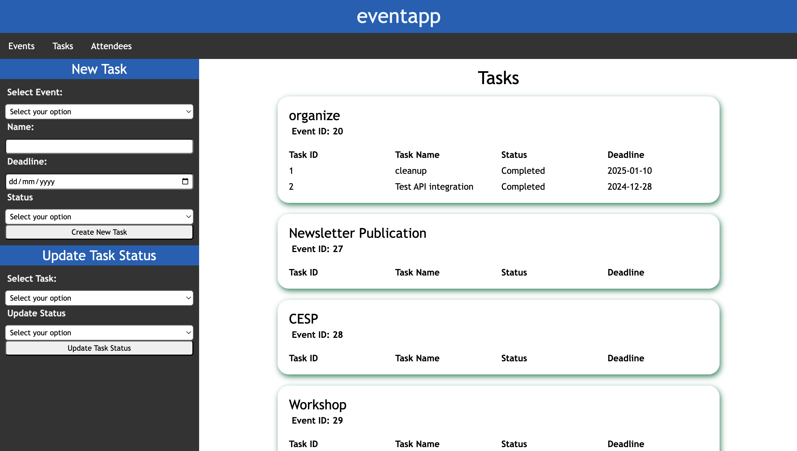
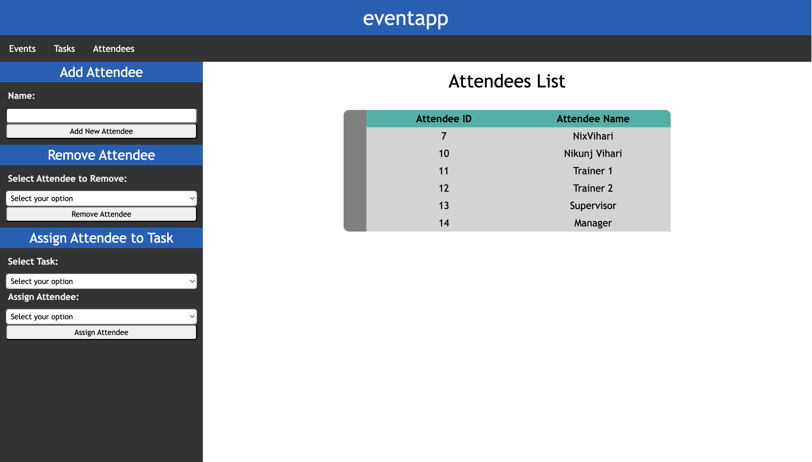

### eventapp - Manage your events

Event Scheduler and Task Tracker

Built using Python and Flask
API tested using Postman

Features
- Event, Task and Attendees pages
- All in one sidebar form controls to create, update or delete
- Functioning API for Events, Tasks and Attendees
- Functioning CRUD operations
- Form input validation
